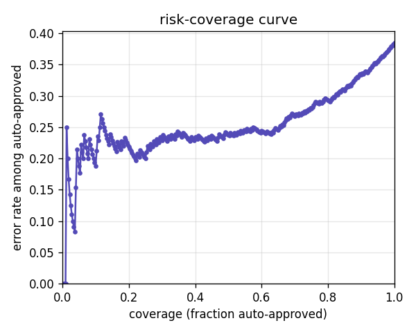
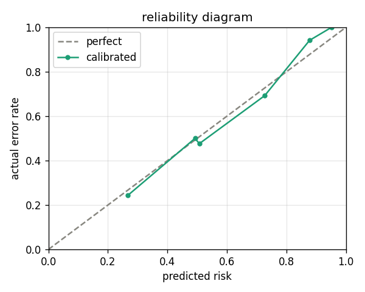

# Gatekeeper

**The escalation-decision layer for LLM extraction.** Not an agent, not another eval
framework — the reliability layer that decides, per field, when to trust an LLM's
extraction and when to escalate it to a human.

Structured extraction with an LLM is good but not perfect. The hard part isn't the
extraction — it's knowing *which* outputs to trust so the system can run unattended
without quietly shipping wrong data. `gatekeeper` sits on top of any extractor and
turns "here's a value" into "trust it, or route it to a person — and here's why."

---

## The honest result

Measured on **real invoice-OCR documents** (`mychen76/invoices-and-receipts_ocr_v1`),
extracted by an **off-the-shelf local model** (`qwen2.5:7b` via Ollama). Neither the
OCR noise nor the model's errors are authored here, so the numbers are honest — and
they improve one variable at a time:

| Stage | Base error | AURC (lower is better) | Precision @ 50% coverage |
|---|---|---|---|
| Cheap signals (grounding + rules), raw grading | 47% | 0.37 | 63% |
| + honest grading (EU decimals, vendor name) | 38% | 0.34 | 67% |
| **+ self-consistency (n=3)** | **38%** | **0.25** | **76%** |

At the final stage you can **auto-approve the confident half of real, messy OCR
invoices at ~76% precision** while escalating the rest — on a 38% base error rate,
that is the confidence layer doing real work. Calibration is honest too (ECE ~ 0.02).




*(Generate these with `python examples/real_invoice_eval.py`; copy the saved PNGs into `docs/`.)*

This is a deliberately honest baseline, not a headline chase. At a strict 97%
precision target, coverage is still 0% — a local 7B model on jumbled OCR can't yet
separate that cleanly, and the README says so. See
[What's real vs. synthetic vs. next](#whats-real-vs-synthetic-vs-next).

---

## The problem

Modern LLM extraction is accurate enough to be tempting and wrong often enough to be
dangerous. If you auto-process every extraction, you ship the errors silently; if you
send everything to a human, you've automated nothing. The valuable decision is the one
in between — *trust this one, escalate that one* — and it has to be made per field,
calibrated to real error rates, and priced by what a mistake actually costs. That
decision is what `gatekeeper` packages.

---

## How it works

A document flows through a fixed pipeline of swappable components:

```
extract  ->  signal  ->  calibrate  ->  decide  ->  measure  ->  improve
```

- **extract** — an LLM turns messy text (invoice OCR, a broker email) into structured fields.
- **signal** — cheap, external checks score each field's trustworthiness: self-consistency (does the model agree with itself across samples?), grounding (is the value actually supported by the source?), and business rules (is it plausible?).
- **calibrate** — a from-scratch logistic calibrator learns, from labeled data, to turn those signals into an honest per-field risk = P(this value is wrong).
- **decide** — a cost-aware policy sets each field's threshold from economics (`review_cost / error_cost`) and escalates the record if any *critical* field is uncertain. A **provable** risk-controlled threshold is available for a guaranteed error budget.
- **measure** — a leakage-safe eval harness plots the risk-coverage curve, AURC, calibration, and per-signal ablations on a held-out split.
- **improve** — a feedback loop folds human corrections of escalated items back into the calibrator (active learning — the escalated items are the most informative labels).

Every stage is a swappable interface (`Extractor`, `SignalGenerator`, `Calibrator`,
`Policy`), so a new model, signal, or domain drops in without touching the rest.

---

## Quickstart

```bash
pip install -e ".[dev]"     # core + pytest (zero required runtime dependencies)
pytest -q                   # 66 passed
```

**See the gate catch errors — offline, deterministic, no model needed:**

```bash
python examples/freight_gate_demo.py
```

Simulates a real model's freight-extraction mistakes and shows the confidence layer
escalating them instead of waving them through.

**Gate documents with a local model** (needs [Ollama](https://ollama.com) running):

```bash
python -m gatekeeper.app --freight --html report.html    # freight-email demo
python -m gatekeeper.app --html report.html              # invoice fixtures
```

Writes a standalone HTML report of every field, its risk, and the verdict.

**Run the honest evaluation on real invoice OCR** (needs Ollama + `datasets`):

```bash
pip install -e ".[real,eval]"
python examples/real_invoice_eval.py --limit 200 --consistency-n 3
python examples/analyze_saved.py     # instantly re-analyze thresholds, no re-extraction
```

---

## Related work

`gatekeeper` is an implementation of an established production pattern, not a novel
technique — and it's built the way practitioners describe:

- **vatvengers, *Building a Stability-Based Gate for LLM Outputs*** — a production trust-gate for VAT extraction (fine-tuned model + stability signal + meta-classifier). The same architecture, in production, which validates the premise.
- **USQRD, *Why LLM Confidence Scores Lie*** — argues that external, verifiable signals beat introspective ones, that ensemble disagreement across samples is the confidence measure that works, and that autonomy is economic (act only where calibrated error is below the cost of being wrong). `gatekeeper` follows all three.
- **Jung et al., *Trust or Escalate: LLM Judges with Provable Guarantees for Human Agreement* (2024)** — the source of the provable risk-controlled threshold here, and the finding that agreement-among-samples is better calibrated than a model's own predictive probability (which justifies the signal choice below).

---

## Design notes

- **Model-agnostic by choice.** Confidence comes from *sampling agreement*
  (self-consistency), not token log-probs — because a local off-the-shelf model
  doesn't expose them, and because agreement is better calibrated than predictive
  probability anyway (Trust or Escalate, 2024). The gate works on any model you can
  call, not only ones you control.
- **Zero required dependencies.** The whole library is standard-library Python,
  including a from-scratch logistic-regression calibrator. `matplotlib` (plots) and
  `datasets` (the real eval) are opt-in extras.
- **Per-field, not per-document.** Each field gets its own risk and verdict; the
  record escalates only when a *critical* field is uncertain.

## Honest limitations

- **The invoice values are synthetic** (shareable data), but the OCR noise and the
  model's errors are real and unauthored — which is what makes the calibration
  numbers honest.
- **Freight is a synthetic demo.** No public labeled freight-tender dataset exists
  (broker email is proprietary), so freight is a generator with known ground truth.
  Real numbers come from the invoice data; freight shows the approach generalizing.
- **Self-consistency misses correlated errors** — if every sample shares the same
  wrong assumption (a systematic OCR misread), the model agrees with itself and the
  gate trusts it. External grounding/rules catch some of these, not all.
- **Off-the-shelf and local.** A fine-tuned model with true log-probs (as in the
  vatvengers production system) reaches much higher coverage at high precision; the
  gap here is expected and explainable, not a failure of the approach.
- The provable threshold uses a conservative (Bonferroni) multiplicity correction;
  fixed-sequence testing would be tighter.

---

## What's real vs. synthetic vs. next

| | Status |
|---|---|
| Confidence-gating pipeline (extract to improve) | **real, 66 tests, zero deps** |
| Evaluation on real invoice OCR | **real** (values synthetic, errors unauthored) |
| Freight-email domain | **synthetic** demo (no public real data exists) |
| Two-temperature stability signal | future work (a richer self-consistency variant) |
| Simulated Annotators (diverse-prompt confidence) | future work |
| Cascade: cheap model to strong model to human | future work (needs a second backend) |
| Log-prob signals via a cloud/vLLM backend | future work |

---

## Build map

Built as a walking skeleton first, then real components one at a time, measured before
improved:

- **§0 foundations** — data model (`Record`, per-field `Signal`/`Decision`), schema, the four swappable interfaces, and end-to-end stubs.
- **§1 dataset** — labeled examples, a type-aware correctness function, leakage-safe dev/calibration/test splits, and pluggable loaders.
- **§2 extractor** — schema to prompt to JSON with defensive parsing; local Ollama and a canned fake client.
- **§3 signals** — self-consistency, grounding, and rule signals (no single signal catches everything).
- **§4 calibration** — from-scratch logistic regression + Expected Calibration Error.
- **§5 policy** — cost-aware per-field thresholds, plus empirical and **provable** risk-controlled operating points.
- **§6 feedback** — corrections of escalated items refit the calibrator (active learning).
- **§7 evaluation** — risk-coverage curve, AURC, selective error, per-signal ablation, plots.
- **§8 app** — a CLI and a standalone zero-dependency HTML report.
- **§1b domains** — a synthetic freight-email generator and the real invoice-OCR adapter.

---

## License

MIT — see [LICENSE](LICENSE).

Built by **Hindavi Dinesh Churi** ([@Lolale3](https://github.com/Lolale3/)).
